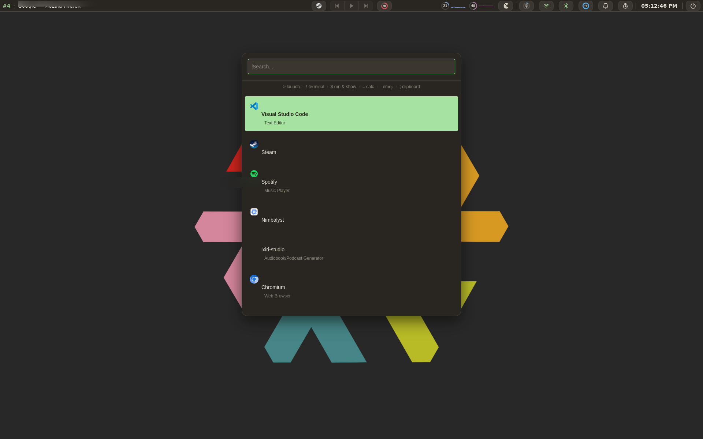
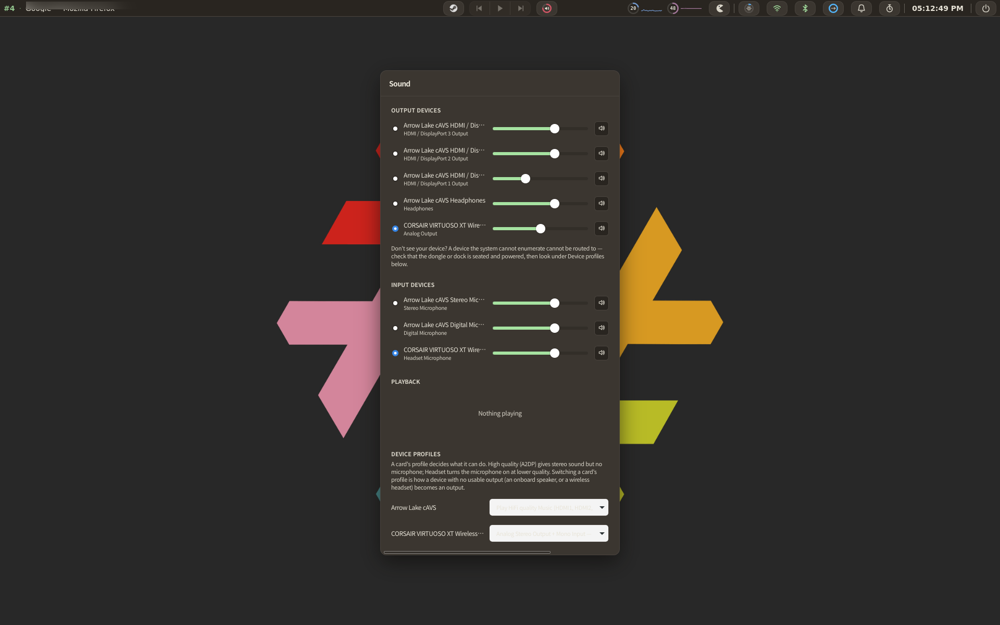
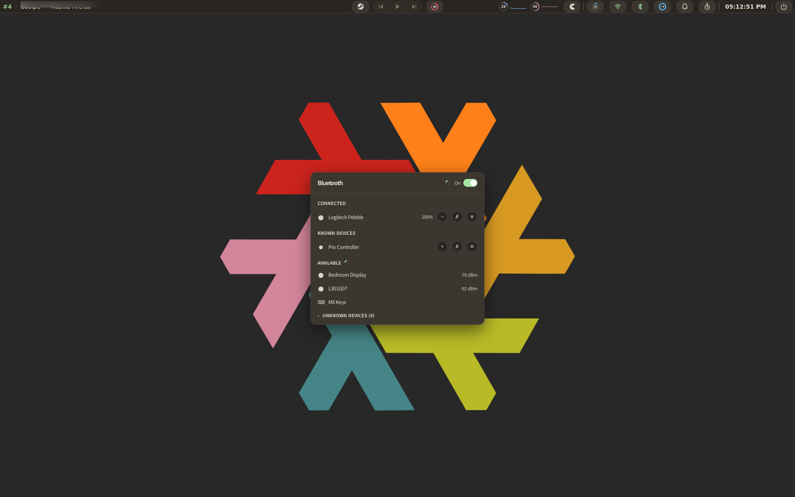
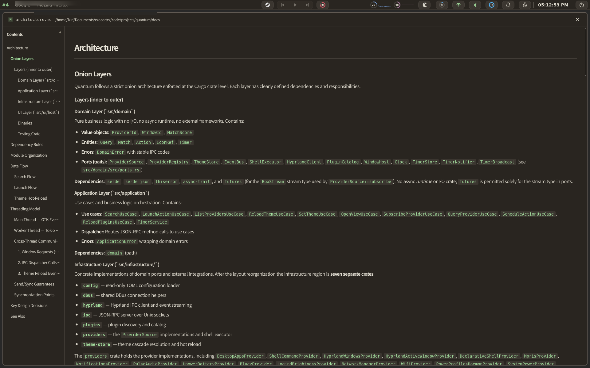

# Quantum

A desktop shell for Wayland. Launcher, status bar, notifications, and system menus — all in one daemon.



## What it does

Quantum runs as a single daemon on Hyprland. It gives you:

- **Launcher** with fuzzy search across apps, open windows, and shell commands. Prefix modes: `=` calculator with unit conversion, `:` emoji picker, `;` clipboard history with image thumbnails. Ctrl+K opens secondary actions on any result.
- **Status bar** spanning each monitor — workspaces, active window title, media controls, system tray, clock. Per-monitor: plug in a display, the bar appears.
- **Wi-Fi manager** — scan, connect, switch bands, see signal strength. No NetworkManager applet needed.
- **Sound mixer** — per-device volume sliders for every output and input, playback info, PipeWire/PulseAudio device profile switching.
- **Notifications** — D-Bus notification daemon with toast popups and a notification center.
- **Bluetooth manager** — pair, connect, forget, switch profiles.
- **Timers** — create, edit, dismiss. Persistent across restarts. Desktop ring indicator in the bar.
- **File explorer** — panel view with places sidebar, right-click context menus, recursive folder sizing, file previews (markdown, code, images, video).
- **File viewer** — open any file for read-only preview from the shell with `qv <path>`.
- **System tray** — full D-Bus system tray with nested menus (SNI + dbusmenu).
- **Clipboard manager** — searchable history with image support, accessible from the launcher.

## Screenshots

### Status bar


### Sound mixer



### Bluetooth



### File viewer



## Tech stack

Rust daemon (Tokio + GTK4 + WebKitGTK + gtk4-layer-shell) serving Svelte 5 frontends over a custom `quantum://` URI scheme. IPC via Unix socket. Controlled with `quantumctl`.

## Build and run

Builds run through a nix-shell (`shell.nix`) that provides the correct Rust toolchain, GTK4, WebKitGTK 6, and gtk4-layer-shell.

```bash
just build          # build all crates
just test           # run all tests
just lint           # clippy, warnings as errors
just fmt            # format rust code
just dev            # run the daemon in dev mode
```

Or directly through the nix-shell wrapper:

```bash
./scripts/devsh.sh cargo build --bin quantumd --bin quantumctl
```

### Install the binaries

```bash
./scripts/devsh.sh cargo install --path src/binaries/quantumd
./scripts/devsh.sh cargo install --path src/binaries/quantumctl
```

### Keybind

Add to your Hyprland config:

```conf
bind = SUPER, SPACE, exec, quantumctl toggle launcher
```

See [packaging/hyprland/example.conf](packaging/hyprland/example.conf) for window rules and widget keybinds.

### Systemd service

```bash
mkdir -p ~/.config/systemd/user
cp packaging/systemd/quantum.service ~/.config/systemd/user/
systemctl --user daemon-reload
systemctl --user enable --now quantum
```

### Without nix (unsupported)

You will need GTK4, WebKitGTK 6, and gtk4-layer-shell development packages, plus a manual pkg-config alias (`gtk4-layer-shell.pc` pointing at `gtk4-layer-shell-0.pc`). The nix-shell handles this automatically.

## Architecture

Onion architecture enforced at the Cargo crate level:

- **Domain** — pure types, errors, port traits. No I/O.
- **Application** — use cases and business logic.
- **Infrastructure** — providers, IPC, D-Bus, Hyprland, config, files, processes.
- **UI** — GTK4 + WebKitGTK windows and Svelte frontends.

See [docs/architecture.md](docs/architecture.md) for the full layout.

## Documentation

- [Architecture](docs/architecture.md) — layers, modules, threading model
- [Protocol](docs/protocol.md) — IPC methods and message formats
- [Theming](docs/theming.md) — writing and customizing themes
- [Development](docs/development.md) — fast local iteration workflow

## License

MIT
