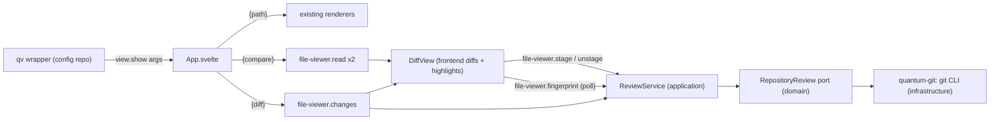

# qv Diff Mode — Design

Status: **design, pending approval.** Companion playground (every visual choice below was settled in it,
by seeing): `docs/playgrounds/qv-diff-playground.html`. Implementation plan: to be written next
(`docs/plans/2026-10-08-qv-diff-mode.md`).

## Goal

Give qv a diff mode with native syntax highlighting, built first for **reviewing what an agent changed**:
open a repository's changes, read them with full language coloring, and stage each file as it is
reviewed — staging is the review marker. A second, read-only source compares two arbitrary files.

## Sources

| Command | Compares | Files | Staging |
|---|---|---|---|
| `qv --diff` | `HEAD` → working tree (staged + unstaged + untracked) | many | yes |
| `qv --diff <ref>` | `<ref>` → working tree | many | only when `<ref>` is `HEAD` (D2) |
| `qv --diff <a>..<b>` | `<a>` → `<b>` (committed history) | many | no, read-only |
| `qv <a> <b>` | file `<a>` → file `<b>` | one pair | no, read-only |
| `qv <file>` | unchanged: today's viewer | one | n/a |

## Current state (confirmed by reading the source)

- `qv` is a bash wrapper in the **system config repo**, not quantum:
  `code/infra/config/modules/features/home/quantum.nix:150`. It runs
  `quantumctl show plugin/file-viewer/file-viewer#<instance> --args '{"path": "<realpath>"}'`.
  Changing its argument forms is a config-repo change that ships with `just build` + Ross's `just switch`.
- The daemon's PATH is set by `makeWrapper` in the same file (`quantum.nix:141`:
  `libcanberra-gtk3`, `pulseaudio`, `qkill`). **git is not on it.** quantumd runs as a user service and
  does not inherit the login shell's PATH (the known `SoundPlayer` trap in `AGENTS.md`), so `git` must be
  added there or every git call fails in production while passing in a dev shell.
- quantum has **no git integration** today (no `git` invocation, no `git2`/`gix` crate).
- The viewer reads through `file-viewer.read` → `FilesService::read_for_viewer`
  (`src/application/src/use_cases/files_service.rs:249`) → `quantum-files`
  (`src/infrastructure/files/src/filesystem.rs:572`), which already rejects binary and oversized files.
  `bridge.rs:150` special-cases `file-viewer.read` (image resource generations); new methods need no such
  handling because they return text only.
- Highlighting: `highlight.js` core with 15 languages (`lib/highlighter.ts`; `toml` is an alias of `ini`), colored by
  `lib/highlight-theme.css`. Highlighting today is **per line** (`CodeRenderer.svelte:83`), which is wrong
  for multi-line constructs — the diff must not inherit that.
- `DirectoryWatcher` (`src/infrastructure/files/src/watcher.rs:128`) is **non-recursive**; it cannot detect
  edits deep in a repository.
- `color-mix()` is already used by the viewer (`Header.svelte:72`), so the tint approach is proven in
  WebKitGTK.

## Settled visual and interaction spec

This is the playground's final output (with Ross's wording tweak: the interface says **staged**, never
"reviewed"). It is the acceptance reference for every frontend task.

- **Layout:** default unified; a Unified / Split segmented toggle in the header beside the +/- stats.
  Long lines do not wrap (unified scrolls sideways; split sides scroll in sync). Judged at 900px (qv opens
  at 900x700).
- **Multi-file navigation:** a 220px "Changes" sidebar (status letter, filename, directory, +/- counts)
  beside all files stacked in one scroll, each with a sticky, click-to-collapse file header; the sidebar
  entry tracks the file in view and clicking it jumps there.
- **Highlighting:** tokenize the WHOLE old and new file contents with highlight.js (never hunk fragments),
  reusing `highlight-theme.css`; syntax colors on every line; the change shown by background tint.
  Change colors are the theme tokens `--color-accent` (added) / `--color-error` (removed); 14% line tint
  (`color-mix` with transparent). Word-level intra-line emphasis at 35%, applied by splitting syntax tokens
  at the changed ranges, only for paired lines at least 40% similar.
- **Gutter:** 3px colored edge bar on changed lines; old and new line-number columns; metrics match
  `CodeRenderer` (13px mono, line-height 1.6, muted 50% numbers, border-right divider).
- **Context:** 3 unchanged lines around each change; longer runs collapse into a clickable expander showing
  the hidden count plus the syntax-highlighted enclosing scope line (scope of the first *changed* line, not
  git's "line before the hunk"). Expanded regions show slim "Hide N expanded lines" bars at top and bottom.
  Overview ruler: 10px change map on the right edge (ticks per changed line, mixed pairs as a split
  green/red tick, viewport thumb, click to jump) — the shared ruler described under "Folded in" below.
- **Copy:** only file text is selectable. Line numbers, signs, region labels, file headers, the sidebar and
  split filler are `user-select: none` **and** excluded by a copy handler that rebuilds `text/plain` from the
  selected code cells (blank lines survive). Split view: a selection is locked to the side it started on.
  Unified view: a selection spanning a change copies the new side only. A selection crossing a collapsed
  region copies the hidden lines too, so the clipboard is always a contiguous piece of the real file.
- **Staging:** sidebar and content split into **Unstaged** (index → working tree, including untracked) and
  **Staged** (HEAD → index). A partially staged file (staged, then edited again) appears in both; its
  Unstaged entry shows only the post-staging edits with a "partially staged" tag. Controls: a "Stage" /
  "✓ Staged" button in each sticky file header, a checkbox on each sidebar entry, and `s` on the current
  file. A staged file collapses (click to reopen). Untracked files show a `U` letter and respect
  `.gitignore`. Header shows "n of m staged" with a small progress bar (a file counts when it has no
  unstaged changes).
- **Live changes:** when files change on disk, a banner under the header: "Files changed on disk since
  this diff loaded." with Refresh (R). Never re-diff automatically. (The playground showed a count; the
  fingerprint used for detection cannot count files, and qv's own staging must not trigger the banner —
  see plan Task 19.)
- **Keyboard:** `n`/`p` change, `]`/`[` file, `s` stage/unstage, `R` refresh, `Ctrl+F` search (existing
  search bar over the diff text), `Escape` closes; a 24px hint bar lists them.
- **Renames** (git rename detection): `R`, "old name → new name" in the file header, "renamed from" in the
  sidebar, diffing old against new content. **Large files** (over ~1000 changed lines): a dashed
  "Large diff: N changed lines, not rendered yet. [Load diff]" placeholder.
- **Header:** existing qv header with a `±` badge, the range ("HEAD → working tree") or "a ↔ b", repository
  path, total +/- counts.

## Architecture



**Decided:** the frontend computes the line diff (the `diff` npm package, also used for intra-line word
diffs) from full old/new contents; Rust supplies contents and runs git. One renderer serves both sources.

### Rust

| Layer | Addition |
|---|---|
| `domain` | Types `DiffSpec { repository, base, target }`, `ChangeSet`, `ChangedFile`, `FileSide`; port `RepositoryReview` with `changes(spec)`, `stage(root, path, blob)`, `unstage(root, path)`, `fingerprint(root)`. serde only — no new dependencies. |
| `application` | `ReviewService` wrapping the port; dispatcher methods `file-viewer.changes`, `file-viewer.stage`, `file-viewer.unstage`, `file-viewer.fingerprint`. |
| `infrastructure` | New sibling crate **`quantum-git`** (`src/infrastructure/git`): `tokio::process::Command` running `git -C <root>` with argument arrays (no shell) and `--` before paths. Added to the `AGENTS.md` onion table and the architecture test's allowed set. |
| `quantumd` | Wire the adapter into `ReviewService`. |

`ChangeSet` (serde `snake_case`, mirrored by hand in `@quantum/client` per the no-codegen rule):

```text
ChangeSet { repository_root, base_label, target_label, stageable: bool, files: [ChangedFile] }
ChangedFile { path, old_path?, language?, base?: FileSide, index?: FileSide, target?: FileSide }
FileSide { content?: string, blob: string, binary: bool, too_large: bool }
```

`index` is present only when `stageable`. A missing side means the file is absent there (added/deleted).

**Git commands** (all read-only except stage/unstage):

- Root: `git rev-parse --show-toplevel` from the directory qv passed.
- File list, working-tree target: `git status --porcelain=v2 -z --untracked-files=all` (gives staged vs
  unstaged per file, renames with original path, untracked). Other bases/targets:
  `git diff --name-status -z -M <base> [<target>]` plus `git ls-files --others --exclude-standard -z`
  when the target is the working tree.
- Contents: `git cat-file --batch` for `<base>:<path>` and `:<path>` (index) blobs in one process; working
  tree read from disk with the same size cap and binary detection as `read_for_viewer`. Working-tree blob
  ids from `git hash-object -w --path=<path> <file>` (see D1).
- Stage: see D1. Unstage: `git restore --staged -- <path>`.
- Fingerprint (for the banner): `GIT_OPTIONAL_LOCKS=0 git status --porcelain=v2 -z --untracked-files=all`
  plus `(mtime, size)` of each listed path, hashed. `GIT_OPTIONAL_LOCKS=0` stops polling from taking
  `index.lock` and colliding with the agent's own git commands.

**Safety boundary:** stage/unstage accept only a path that appears in the change set this window loaded
(rejects anything else), against the root `rev-parse` returned. They only touch that repository's index;
both are reversible.

### Frontend (file-viewer view)

- `App.svelte` branches on `__quantum_args`: `{path}` (today), `{compare: {left, right}}`,
  `{diff: {repository, base?, target?}}`.
- Pure modules under `src/lib/diff/`, each with vitest coverage (ports of the playground logic):
  `lineDiff.ts`, `rows.ts` (context collapse, expanded regions, scope label, hunk counts),
  `intraline.ts` (40% similarity gate), `highlightLines.ts` (whole-file highlight.js → per-line token
  lists by carrying open spans across newlines, then merging emphasis ranges), `copyText.ts` (clipboard
  text from an ordered list of selected cells), `reviewModel.ts` (ChangeSet → Unstaged/Staged entries,
  status letters, partial staging, progress).
- Components: `DiffView`, `ChangesSidebar`, `DiffFile` (sticky header + rows), `DiffRows` (unified/split
  with synchronized horizontal scroll), `CollapsedRegion`, `OverviewRuler`, `ChangedOnDiskBanner`,
  `KeyHintBar`. Search reuses `SearchBar` with the diff reporting match counts like other renderers.
  New keys extend `viewerKeymap.ts`, active only in diff mode.
- Fingerprint polling every 2 seconds while the window is open; a changed fingerprint shows the banner.

### qv wrapper and packaging (config repo)

- `qv <file>` unchanged; `qv <a> <b>` sends `{compare: {left, right}}` (both `realpath`ed);
  `qv --diff [<range>]` sends `{diff: {repository: $PWD, base, target}}`, defaulting to `HEAD` → working
  tree. Usage text lists all three.
- `makeWrapper --prefix PATH` gains `pkgs.git`.
- Deploy: change, `just build`, hand off to Ross for `just switch`.

## Error handling

| Case | Behavior |
|---|---|
| Not a git repository | Full-window error: "Not a git repository: <dir>". |
| Bad ref | Full-window error with git's stderr. |
| `git` missing on the daemon's PATH | Explicit error naming quantumd's PATH (the service-PATH trap), never a silent empty list. |
| Binary file | File section placeholder "Binary file changed" with sizes; still stageable. |
| Over the size cap | Placeholder "Too large to diff (N MB)"; still stageable. |
| Stage/unstage fails | Error banner with git's stderr; state re-read from git, never assumed. |
| Empty change set | "No changes" empty state, not a blank window. |

Every git failure is surfaced (no `Err(_) => Vec::new()` — the tray-menu lesson in `AGENTS.md`).

## Testing

- **Rust `quantum-git`:** integration tests against throwaway repositories (`git init` in a temp
  directory) covering modified, staged, partially staged, untracked, ignored, deleted, renamed, binary,
  and oversized files; stage of an exact blob; unstage; fingerprint changes on a re-edit of an
  already-modified file; path-not-in-change-set rejection.
- **Application/dispatcher:** `ReviewService` with a fake port; parameter parsing for the four methods.
- **Frontend:** vitest for every pure module — including the playground's verified copy cases
  (contiguous copy across a collapsed region, new-side-only across changes, split side lock) — and
  component tests (`$effect`, not `onMount`).
- **Real path:** build, run a dev daemon, `qv --diff` in a scratch repository exercising every file state.
  Ross gets **one** look, after asking (never loop windows on his desktop).

## Acceptance criteria

1. `qv --diff` in a repository with modified, staged, partially staged, untracked, deleted and renamed
   files lists each under the correct section with the correct letter and +/- counts.
2. A block comment opened above a hunk colors the hunk's lines as comment (whole-file highlighting).
3. Copying any selection yields only file text; the three copy rules above hold.
4. Stage then `git status` shows the file staged; unstage reverts it; the view matches git after each.
5. Editing a file after the diff loads shows the banner within about 2 seconds; staging that file stages
   exactly the content on screen (D1), and after refresh the newer edits appear as unstaged.
6. Over-1000-line diffs render the placeholder; binary files render their placeholder.
7. Running under the systemd service (not a dev shell) finds `git`.
8. `qv <a> <b>` and `qv --diff A..B` show no staging controls.

## Assumptions

- git ≥ 2.23 (`git restore`) on the host — true for current nixpkgs.
- Adding the `diff` npm package (small, no dependencies) to the file-viewer view is acceptable.
- Whole-file highlighting is affordable within the existing size cap; very large files hit the placeholder.

## Decisions (approved by Ross, 2026-10-08)

- **D1 — Stage what you saw.** At load, record each working-tree file's blob id (`git hash-object -w`);
  Stage runs `git update-index --add --cacheinfo <mode>,<blob>,<path>`, staging exactly the displayed
  content even if the agent has since edited the file. Newer edits show as unstaged after refresh (partially
  staged). This replaces the playground's refuse-if-changed guard: correct by construction, no refusal path,
  no race window. Deletions use `git update-index --remove`.
- **D2 — Staging only when the base is `HEAD`.** `qv --diff` and `qv --diff HEAD` can stage; any other base
  is read-only in the first version. Mixing committed history with staging is a follow-up.

## Folded in: Ctrl+F performance and scrollbar match markers

Added at Ross's request after two research passes (2026-10-08). Both apply to every qv renderer, not just
diff mode, and they share the overview ruler.

### Ctrl+F slowness — root cause (proven by measurement)

- **Per keystroke, not navigation.** Each keystroke runs `clearMarks` → `findMatchesInDom` → `wrapRanges`
  (`MarkdownRenderer.svelte:269-281`). Navigation only toggles a class (`:283-289`) and is fast.
- **Primary cause: `wrapRanges` is O(matches × text nodes)** (`MarkdownRenderer.svelte:247-248`): for every
  match it filters every text node in the document with `Range.intersectsNode`. The example file
  (`murmur8/docs/plans/2026-10-08-mcp-large-file-upload-design.md`, 677 lines) produced 142 × 1597 =
  226,774 calls for "upload". Measured in jsdom: 16.7 s for "upload", 157 s for "u". jsdom exaggerates the
  per-call cost; the quadratic is engine-independent.
- **Compounding cause in WebKit: live `Range` objects.** WebKit updates every live range on each text split
  and insertion. Measured in headless WebKitGTK 2.52.6: wrapping 2000 marks took 11 ms with `splitText` and
  no ranges versus 3.9 s while 2000 ranges were alive. `findMatchesInDom` keeps one live range per match
  while `wrapRanges` mutates.
- **Mermaid is not the cause** (stripping the fences changed nothing).
- **Secondary (Code/JSON):** `highlightedLines` (`CodeRenderer.svelte:82-84`, `JsonFoldRenderer.svelte:169-177`)
  depends on the match map, so every keystroke re-runs highlight.js over every line (about 50-100 ms for
  500 lines).

**Fix (root cause, not a debounce):**
1. Search returns per-node segments `{ node, start, end, matchIndex }` computed from the offsets
   `collectTextSpans` already produces, with one ordered two-pointer walk (O(spans + matches)); no
   `Range` objects are created. `wrapRanges` splits right to left with `splitText` and wraps. Prototype:
   16.7 s → 130 ms ("upload"). Cache `{ text, spans }` per rendered HTML so only matching and wrapping
   re-run per keystroke.
2. Code/JSON: derive base syntax HTML per line from `lines`/`language` only; apply search marks only to
   matched lines.
3. Existing behavior is preserved: `matchMarks: HTMLElement[][]` per match (current-match class and scroll
   unchanged), cross-inline matches stay one logical match, diagram source is never wrapped.

### Scrollbar match markers (one shared overview ruler)

- **Placement:** a separate 10px strip beside the scroll pane (not painted into the native scrollbar),
  **always reserved** for text-like files (Markdown, JSON, code, text) and drawn only when it has marks, so
  Ctrl+F never reflows Markdown sideways. Verified in headless WebKitGTK that native scrollbar styling is
  possible, but rejected: track clicks page instead of jumping.
- **Shared parts:** `lib/overviewRuler.ts` (pure: segment layout with per-kind minimum heights, merging of
  touching same-kind marks, lanes, thumb geometry, click hit-testing), `lib/measureOffsets.ts` (one
  batched read pass, `ResizeObserver` coalesced to one `requestAnimationFrame`), `lib/OverviewRuler.svelte`
  (props: `marks`, `scrollElement`, `onMarkActivate`). Diff mode's change map uses the same component.
- **Positions:** renderers gain `onMatchPositions(positions: Float64Array)` (same order as
  `currentMatchIndex`, length equal to the reported count) and a bindable `scrollElement`. Code (virtual and
  short), JSON and long text use arithmetic on fixed row heights; matches inside a collapsed fold mark at
  the outermost collapsed header (new pure `visibleRowOfLine` in `fold-model.ts`). Short text (wrapping) and
  Markdown measure their match anchors in the batched pass, re-run after each search pass, on content
  resize, and after mermaid finishes.
- **Visuals (tokens only):** lanes — changes left 3px, search right 3px, full width when there are no
  changes. Search marks `--color-fg` at 65% (current match full `--color-fg`, 4px, never merged, drawn
  last); added `--color-accent`; removed `--color-error`; **mixed is a split green/red tick** (no amber
  token exists, and sycamore's warning and error colors are nearly identical); thumb `--color-fg` at 12%.
  DOM divs after merging (at most about 300 per lane), not canvas.
- **Interaction:** clicking a search mark sets `currentMatchIndex` and bumps `navigationRevision` (reusing
  each renderer's reveal path, keeping "k of n" in sync); clicking empty track centers that position;
  `pointerdown` prevents default so focus stays in the search input. Closing search empties the search lane.

### Existing bugs fixed alongside (found during the research, approved by Ross)

- **Text files of 500 lines or fewer cannot scroll:** `TextRenderer.svelte:77-79` renders a bare `<pre>`
  and `.content-area` (`App.svelte:329-333`) has no overflow, under `body { overflow: hidden }`.
- **Code line numbers drift in files of 500 lines or fewer:** `.code-content` scrolls but its sibling
  `.gutter` does not (`CodeRenderer.svelte:188-211`, `.code-renderer { overflow: hidden }`). Adopt
  `JsonFoldRenderer`'s single scroller with a sticky gutter.
- **The default theme lacks `--color-error`:** only `sycamore/tokens.toml:11` defines it, contradicting
  `AGENTS.md`. Add it to `default/tokens.toml` (and correct `AGENTS.md` if needed).

## Out of scope (first version)

Hunk-level staging, committing from qv, `.diff`/`.patch` file input, virtualized scrolling (the large-file
placeholder covers it), inline comments, staging against bases other than `HEAD` (pending D2).

## Documentation to update with the implementation

`AGENTS.md` file-viewer entry (no longer purely read-only: diff mode can stage), the onion table and
architecture test for `quantum-git`, the service-PATH note (git joins the wrapper), and the `qv` usage line
in the root `exocortex/AGENTS.md` "use qv" section.
